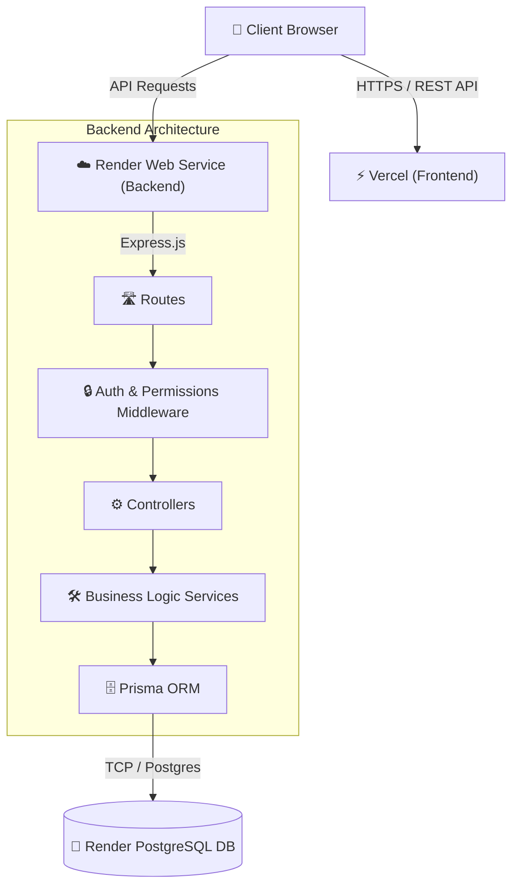

# WaziApp Backend

This is the Node.js/Express backend for WaziApp, a multi-tenant project management SaaS. 
It uses Prisma ORM with a PostgreSQL database, secured with Role-Based Access Control (RBAC) via HttpOnly Cookie JWTs.

## System Architecture



## Features
- **Multi-tenancy:** Data isolation using Tenant IDs.
- **RBAC:** Roles (`SUPER_ADMIN`, `ADMIN`, `AGENT`) mapped to fine-grained permissions.
- **Security:** `helmet`, strict `cors`, HttpOnly cookies (`cookie-parser`), `express-rate-limit`, `bcryptjs`, and JWT verification.
- **Validation:** Type-safe DTO validation using `zod`.

## Getting Started

1. Clone the repository and install dependencies:
   ```bash
   npm install
   ```

2. Setup the database:
   Create a local PostgreSQL instance and set the `DATABASE_URL` in `.env`.
   ```bash
   npx prisma db push
   npx tsx prisma/seed.ts
   ```

3. Run the development server:
   ```bash
   npm run dev
   ```

## Production Deployment
The application is configured to deploy directly to Render.
- **Build Command**: `npm install && npm run build`
- **Start Command**: `npm start`
- Environment variables required: `DATABASE_URL`, `JWT_SECRET`, `PORT`
